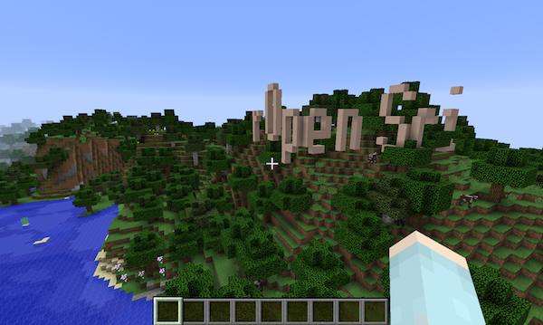
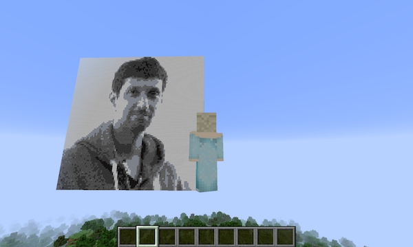
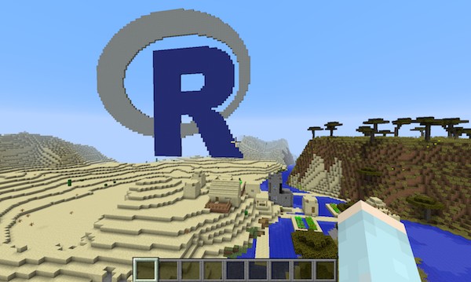
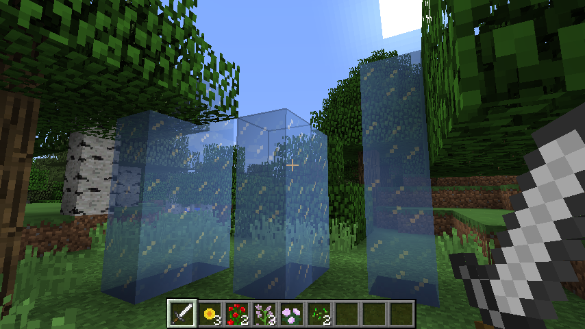
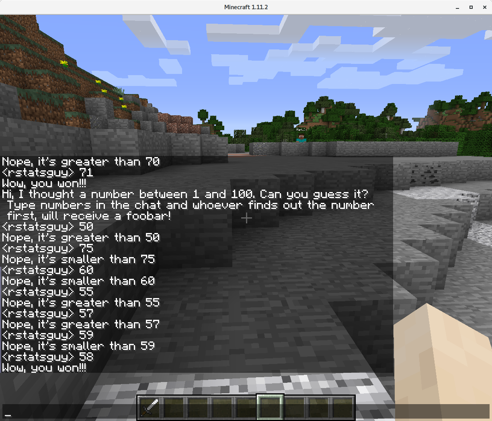

## miner

Following the python module
[py3minepi](https://github.com/py3minepi/py3minepi), this is an R package that allows
connection to the
[Minecraft API](http://www.stuffaboutcode.com/p/minecraft-api-reference.html)
using [RaspberryJuice](https://dev.bukkit.org/projects/raspberryjuice)
and either [Spigot](https://www.spigotmc.org/) or
[Minecraft:Pi](https://minecraft.net/en-us/edition/pi/).

The mineR package provides a few simple functions to manipulate the Minecraft world from R. See
the [vignette](vignettes/mineR.Rmd) for details on setting up a Minecraft server and using
this package.

The
intent of this package is to encourage new R users to learn R by writing scripts to do fun things
in Minecraft. (See the [extra_vignettes](extra_vignettes) folder for details.)
For example, with these functions you could:

### Write words on a hillside:

### Render a photograph as a wall of blocks:

Or the [R](https://www.r-project.org) logo:

### Generate a random maze in R, and create it in the world for players to explore:

 

### Give the player the powers of Elsa: 

[Freeze water as you run over it](https://youtu.be/6gcRyuj0smg)

or create towers of ice with a gesture:

### Write a bot to play a game with players over chat:

.

### And, of course, make `ggplot` plots in Minecraft: 

### About this package

This package was created as part of the [ROpenSci unconference](http://unconf17.ropensci.org/)
in May, 2017 by:

* Brooke Anderson
* Karl Broman
* Gergely Daróczi
* Mario Inchiosa
* David Smith
* Ali Zaidi
