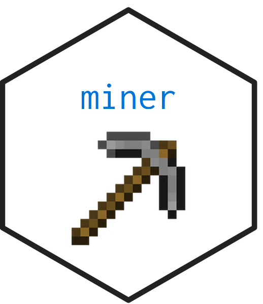
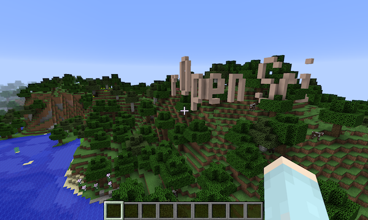
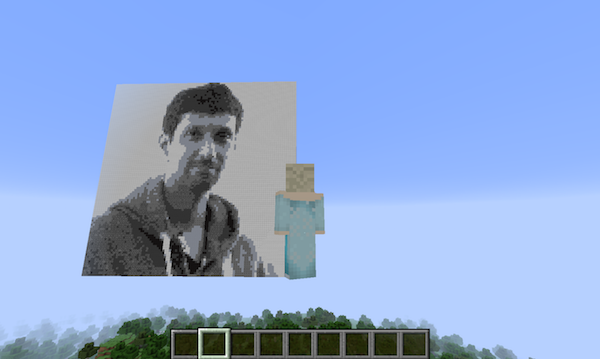
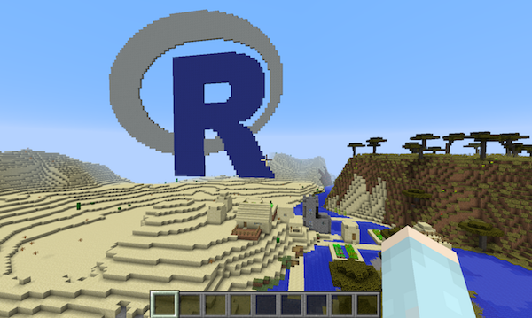
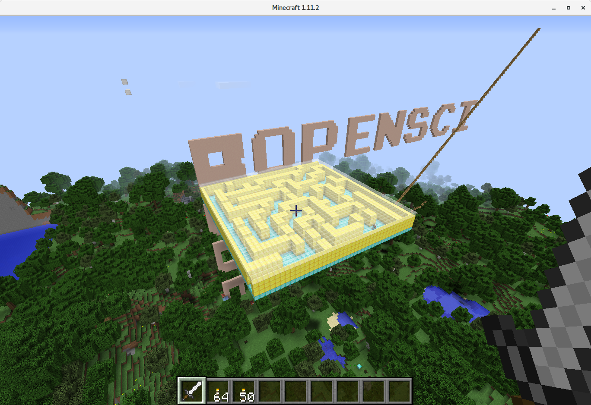
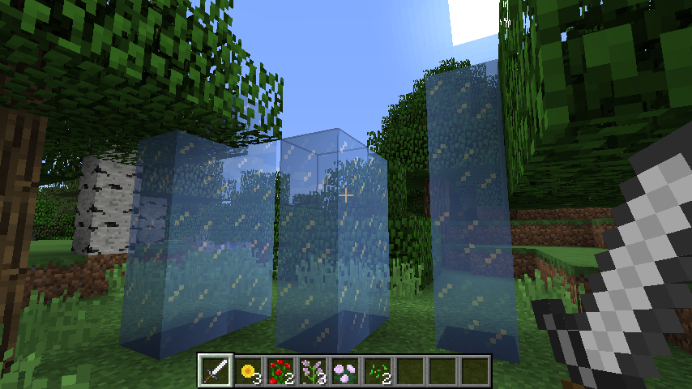
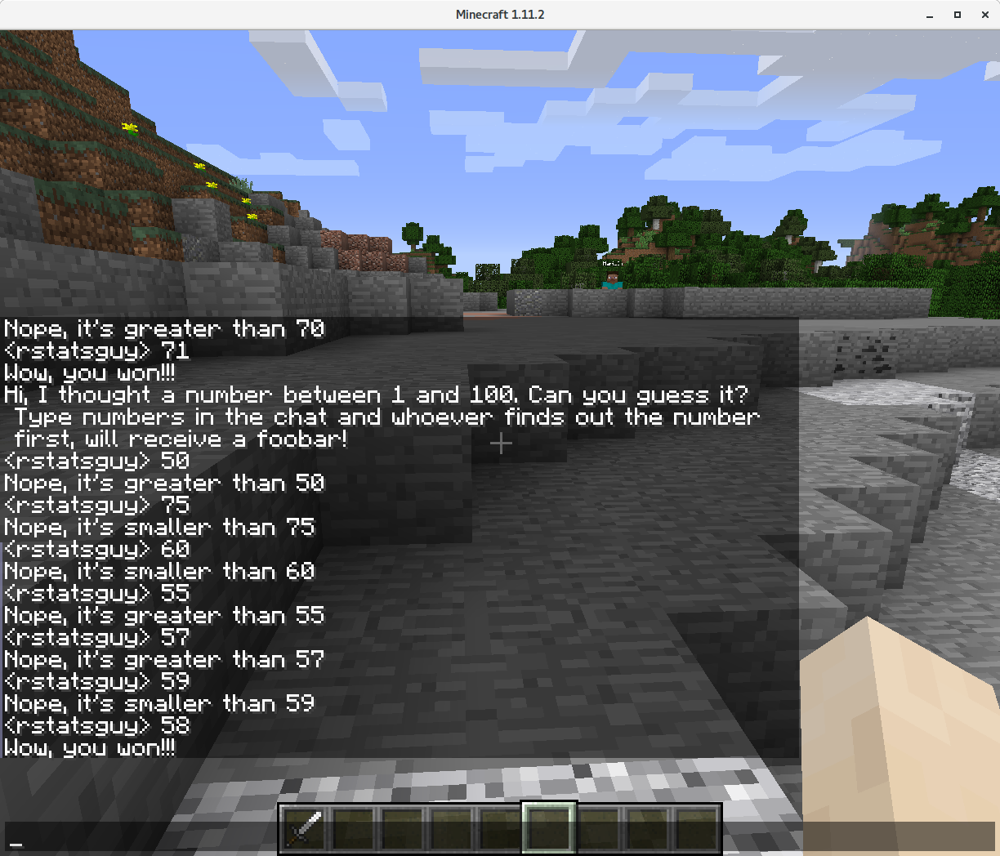
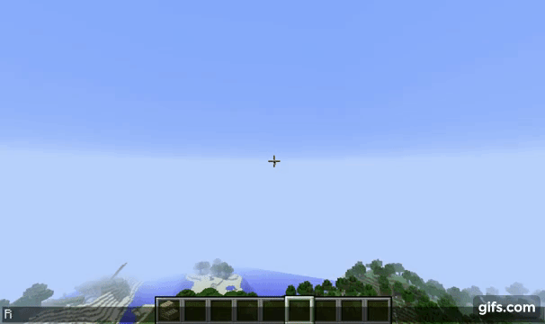

## miner <a href="https://github.com/kbroman/miner"></a>

[](https://github.com/kbroman/miner/actions/workflows/R-CMD-check.yaml)
[](https://kbroman.r-universe.dev/miner)
[](https://doi.org/10.5281/zenodo.20070581)


Following the python module
[py3minepi](https://github.com/py3minepi/py3minepi), this is an R package that allows
connection to the
[Minecraft API](https://www.stuffaboutcode.com/p/minecraft-api-reference.html/)
using [RaspberryJuice](https://dev.bukkit.org/projects/raspberryjuice)
and either [Spigot](https://www.spigotmc.org/) or
[Minecraft:Pi](https://minecraft.net/en-us/edition/pi/).

The miner package provides a few simple functions to manipulate the
Minecraft world from R. The intent of this package is to encourage new
R users to learn R by writing scripts to do fun things in Minecraft.

See the online book, [R Programming with
Minecraft](https://kbroman.org/miner_book/), for details on
setting up a Minecraft server and using this package, and for a
variety of detailed examples. The package also contains a short
[vignette](vignettes/miner.Rmd) on its basic use.

Here are a few of the things you can do with
[miner](https://github.com/kbroman/miner):

### Write words on a hillside:



### Render a photograph as a wall of blocks:



Or the [R](https://www.r-project.org) logo:



### Generate a random maze in R, and create it in the world for players to explore:




This player is operated by a bot trying to find its way out of the maze via a rule-based algorithm:


### Give the player the powers of Elsa:

[Freeze water as you run over it](https://youtu.be/6gcRyuj0smg)

[](https://www.youtube.com/watch?v=6gcRyuj0smg)

or create towers of ice with a gesture:



### Write a bot to play a game with players over chat:

.


### And, of course, make `ggplot` plots in Minecraft:

[](https://www.youtube.com/watch?v=zggCAYAfjXE)

### Extending

The [craft](https://github.com/kbroman/craft) package includes additional functions that illustrate and extend the use of [miner](https://github.com/kbroman/miner). Contributors who want to extend the functionality of [miner](https://github.com/kbroman/miner) should submit a pull request to the [craft](https://github.com/kbroman/craft) package.

### Installation

Install the [miner](https://github.com/kbroman/miner) and
[craft](https://github.com/kbroman/craft) packages from [R
universe](https://r-universe.dev)

```r
install.packages(c("miner", "craft"), repos=c("https://kbroman.r-universe.dev", "https://cloud.r-project.org"))
```

Alternatively, use the
[remotes](https://remotes.r-lib.org) package to install them from
GitHub:

```r
# install.packages("remotes")
library(remotes)
install_github("kbroman/miner")
install_github("kbroman/craft")
```

_Note_: this should automatically install a number of dependent
packages, including [Rmaze](https://github.com/Vessy/Rmaze),
[igraph](https://r.igraph.org), and
[imager](https://asgr.github.io/imager/). To install imager you may
need to install [Xquartz](https://www.xquartz.org/) on Mac or
`libx11-dev` or similar on Linux.

You'll need a Minecraft server that is running the RaspberryJuice
plugin. See the [Installation and configuration](https://kbroman.org/miner_book/installation-and-configuration.html)
section of [R Programming with Minecraft](https://kbroman.org/miner_book/).

### Documentation

[R Programming with Minecraft](https://kbroman.org/miner_book/) is a bookdown book about R and Minecraft, and particularly about using Minecraft with the [miner](https://github.com/kbroman/miner) package. Contributors who want to add documentation should submit a pull request to the [miner_book](https://github.com/kbroman/miner_book) repository on Github.


### About this package

This package was created as part of the [ROpenSci unconference](https<://unconf17.ropensci.org/)
in May, 2017 by:

* [Brooke Anderson](https://github.com/geanders)
* [Karl Broman](https://github.com/kbroman)
* [Gergely Daróczi](https://github.com/daroczig)
* [Mario Inchiosa](https://github.com/inchiosa)
* [David Smith](https://github.com/revodavid)
* [Ali Zaidi](https://github.com/akzaidi)

### License

Licensed under the [MIT license](https://cran.r-project.org/web/licenses/MIT). ([More information here](https://en.wikipedia.org/wiki/MIT_License).)
