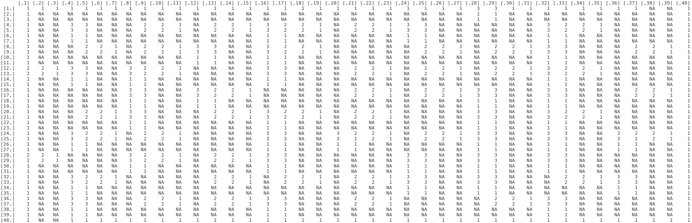

This example illustrates how to generate a perfect maze from R and the render in Minecraft.

## Generate a random maze

First, we need to generate a maze, for which we will use the [`Rmaze`](https://github.com/Vessy/Rmaze) R package's depth-first search algorithm. As the package is not on CRAN, you have to install from GitHub:

```{r rmaze-install, eval = FALSE}
devtools::install_github('Vessy/Rmaze')
```

Then load the package and generate a maze with, for example, 10 x 10 tiles:

```{r maze-gen}
library(Rmaze)

n <- 10
maze <- makeGraph(n, n)
set.seed(42)
maze <- makeMaze_dfs(maze)
```

This is a graph representation of the maze, which can be rendered with `ggplot2` very easily:

```{r maze-plot}
plotMaze(maze, n, n)
```

## Transform maze graph into matrix

Now we have to transform this graph representation into a binary matrix, where we see in 2D which blocks need to be air or wall. Let's start with a large empty `matrix` allowing 4 block for every single cell, as in the matrix we will use blocks for the wall as well (unlike in the above plot):

```{r maze-transform-1}
df <- matrix(NA, nrow = n*4, ncol = n*4)
```

Then let's mark the surrounding border with ones:

```{r maze-transform-2}
df[c(1, nrow(df)), ] <- 1
df[, c(1, nrow(df))] <- 1
```

Here is the top corner of the matrix now: 

```{r}
df[1:4, 1:4]
```

But we should leave the entrance and exit open in the bottom left and top right corner:

```{r maze-transform-3}
df[1, ncol(df) - 1:2] <- NA
df[nrow(df), 2:3] <- NA
```

Here is the top right corner showing the maze exit we just made: 

```{r}
df[1:4, ncol(df) - 3:0]
```

Now we need to convert the graph object into a `data.frame` on which we can iterate later to render the actual wall blocks:

```{r maze-transform-4, message = FALSE, warning = FALSE}
library(igraph)
mazedf <- as_data_frame(maze)
library(data.table)
setDT(mazedf)
```

Then let's extract the `x` and `y` positions from the `A_x_y` names:

```{r maze-transform-5}
for (v in c('from', 'to')) {
    mazedf[, (paste0(v, 'x')) := as.numeric(sub('A_([0-9]*)_[0-9]*', '\\1', get(v)))]
    mazedf[, (paste0(v, 'y')) := as.numeric(sub('A_[0-9]*_([0-9]*)', '\\1', get(v)))]
}
```

And let's also record in which direction the edge points:

```{r maze-transform-6}
mazedf[fromx < tox, direction := 'top']
mazedf[fromy < toy, direction := 'right']
```

Now let's map the `x` and `y` coordinates to the 2D matrix:

```{r maze-transform-7}
mazedf[, x := nrow(df) - fromx * 4 + 3 - as.numeric(direction == 'top') * 2]
mazedf[, y := fromy * 4 - 1 + as.numeric(direction == 'right') * 2]
```

And then let's update the blank matrix `NA` cells with 1, 2 or 3 to represent the actual walls:

```{r maze-transform-8}
for (i in seq_len(nrow(mazedf))) {
    cell <- mazedf[i]
    if (cell$wall == 'ON') {
        df[cell$x + -1:0, cell$y + -1:0] <- 1
    }
    if (cell$direction == 'top' & cell$wall == 'ON') {
        df[cell$x - 0:1, cell$y - 1:2] <- 2
    }
    if (cell$direction == 'right' & cell$wall == 'ON') {
        df[cell$x - 2:3, cell$y - 0:1] <- 3
    }
}
```

I know it was a bit tricky, and probably there's a nicer and lot more elegant way to do all this :) But at least this works and results in something like:



## Render the maze in Minecraft

Now that we have a binary matrix representation of the maze, it's very easy to render the related blocks in Minecraft. First, we need to load the `miner` package and establish a connection to a Minecraft server: 

```{r eval = FALSE}
library(miner)
mc_connect()
```

Next, we will clean up some space, then generate the floor (diamond) and ceiling (glass), then the wall blocks(gold):

```{r maze-render, eval = FALSE}
nr <- nrow(df)
nc <- ncol(df)

## clean up some space
setBlocks(1, 50, 1, nr, 54, nc, 0)
## add floor
setBlocks(1, 50, 1, nr, 50, nc, 57)
## add torch
setBlocks(nr - 4, 51, 2, nr, 52, 4, 50)
## maze ceiling
setBlocks(1, 54, 1, nr, 54, nc, 95)
## 3 blocks tall maze walls
for (i in 1:nrow(df)) {
    for (j in 1:ncol(df)) {
        if (!is.na(df[i, j])) {
            setBlock(i, 51, j, 41)
            setBlock(i, 52, j, 41)
            setBlock(i, 53, j, 41)
        }
    }
}
```

The result looks like this:


For a more complete solution, see the `mc_maze` and `mc_mazer` functions. The prior generates a maze with given dimensions right in front of a specified player id, while the latter does the same but triggered from the chat window by any player.

