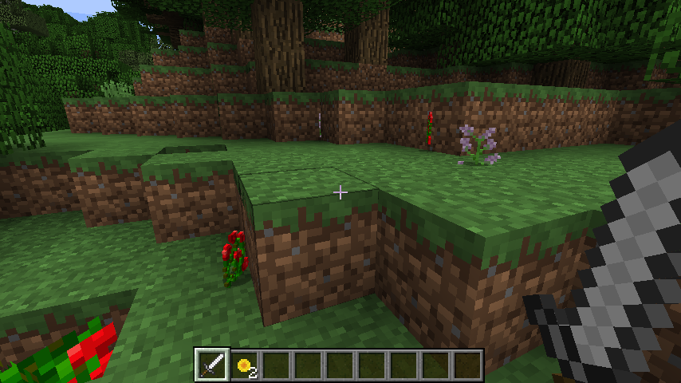

Planting a garden
================
Brooke Anderson

From within R, you can get a record of recent events, like block hits. You can take advantage of this to place blocks at the places you hit. This tutorial shows how to plant random flowers at every spot you hit. It then expands on these ideas to show how to make ice towers.

Connect with a Minecraft server
-------------------------------

First, you need to connect to a Minecraft server, which you can do with the `mc_connect` function:

``` r
mc_connect()
```

Create a dataframe with recent hits
-----------------------------------

The `getBlockHits` function will pull a dataframe with recent hits made by players in the Minecraft world. This dataframe will only include hits that were made by an iron sword and with a right click. Go into the game, make sure you have an iron sword, and use the right click to hit some blocks around you. Go back into R and create a dataframe with those hits using:

``` r
recent_hits <- getBlockHits()
head(recent_hits, 3)
```

        x  y  z block  player
    1  10  0  8     2 5799549
    2  10  0  8     2 5799549
    3  10  0  8     2 5799549

The `getBlockHits` function will return hits from all players. You just want hits that you made. You can use functions in the `dplyr` library to filter the returned dataset just to those you made. You will need to know what your player ID is, but once you do, you can use `filter` to get down to just the rows of the hits dataframe where the player id equals your ID using the logical statement `player == [your player ID]`:

``` r
library(dplyr)
hit_locs <- recent_hits %>%
  filter(player == 5799549)
```

Now you know where your character made hits. The next step is to place flowers there. To start, let's make a dataframe with several of the different flowers available in Minecraft. To do this, we can filter the `mc_items` dataframe that comes with the `miner` dataset to just the rows with certain types of flowers:

``` r
data(mc_items)
flowers <- mc_items %>%
  filter(name %in% c("Sunflower", "Lilac", "Rose Bush", "Peony",
                     "Blue Orchid", "Red Tulip", "Pink Tulip",
                     "Oxeye Daisy"))
flowers
```

             name  id style
    1 Blue Orchid  38     1
    2   Red Tulip  38     4
    3  Pink Tulip  38     7
    4 Oxeye Daisy  38     8
    5   Sunflower 175     0
    6       Lilac 175     1
    7   Rose Bush 175     4
    8       Peony 175     5

Now, you can use a loop. This will loop through every row of the hits dataframe. For each hit, it will randomly pick one of the flower types and place it at that block:

``` r
for(i in 1:nrow(hit_locs)){
  this_flower <- sample_n(flowers, 1)
  setBlock(hit_locs$x[i], hit_locs$y[i], hit_locs$z[i],
           id = this_flower$id, style = this_flower$style)
}
```

If you go back into your Minecraft world, you should see flowers where you made your hits, like this:



Build ice towers
----------------

Expanding on this, instead of just adding in flowers, you could make full towers. The `setBlocks` function lets you fill a cuboid space with a single type of blocks. If you have a dataframe of hit locations named `hit_locs`, as in the previous example, you can add ice towers with random heights between 1 and 4 units at each location using the following loop:

``` r
for(i in 1:nrow(hit_locs)){
  tower_height <- sample(1:4, size = 1)
  setBlocks(hit_locs$x[i], hit_locs$y[i], hit_locs$z[i],
            hit_locs$x[i], hit_locs$y[i] + tower_height, hit_locs$z[i],
            id = 212)
}
```


Write a function to do this interactively
-----------------------------------------

You can expand on this idea and write a function that will "listen" to your Minecraft world from R and build ice towers as you make block hits.

``` r
ice_towers <- function(player_id, delay = 0.2){
  while(TRUE){
    latest_events <- miner::getBlockHits()
    if(nrow(latest_events) == 0) next

    latest_events <- latest_events %>%
      dplyr::filter(player == player_id) %>%
      dplyr::distinct()

    if(nrow(latest_events) == 0) next

    for(i in 1:nrow(latest_events)){
      tower_height <- sample(1:4, size = 1)
      miner::setBlocks(latest_events$x[i], latest_events$y[i], latest_events$z[i],
                       latest_events$x[i], latest_events$y[i] + tower_height, latest_events$z[i],
                       id = 212)
    }
    Sys.sleep(delay)
  }
}
```

You can set this function to run from within your R session with a call like:

``` r
ice_towers(player_id = 7433954)
```

Then you can go inside your Minecraft world, and you should be able to make ice towers anywhere you hit with a right click with an iron sword.

Close the connection
--------------------

When you're done working with the Minecraft world, you can close the connection using `mc_close`:

``` r
mc_close()
```
