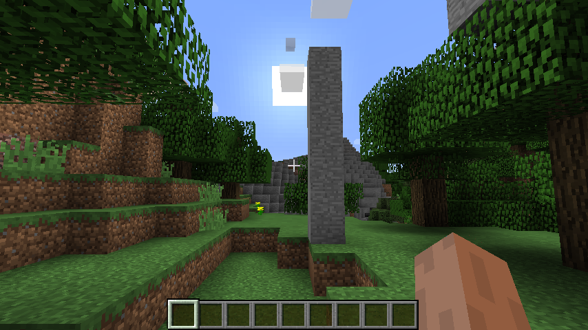

Building a tower and jumping on type
================
Brooke Anderson

This is a very simple example of interacting with a Minecraft world using the functions in `miner`. In this example, you'll build a tower near your player and then move to stand on top of it.

Connect to a Minecraft server
-----------------------------

First, you'll need to connect to a Minecraft server, which you can do using `mc_connect` (use the server's IP address if you aren't connecting to a local Minecraft server).

``` r
mc_connect()
```

Figure out your player ID
-------------------------

Next, you'll need to get the ID for your player, so you can make sure that you build the tower near the right person. The `getPlayerIds` function will print the IDs of all players currently in the Minecraft world:

``` r
getPlayerIds()
```

    [1] 4787622 4998164 5004347 5212137 5299528

If you're not sure which player is yours, there are ways you can try to figure it out. For example, you can leave the game and then come back and see which player ID is added when you come back.

Figure out your current position
--------------------------------

Once you know your player's ID, you can use the `getPlayerPos` function to find your location. Save it to an object so you can reference it to build the column and then move yourself on top:

``` r
my_pos <- getPlayerPos(5004347)
```

Build a tower
-------------

Now you can build a column near yourself. Use the `find_item` function to find an item you'd like to use to build the column. For example, if you'd like to use stone, you can query:

``` r
find_item("Stone")
```

       name id style
    2 Stone  1     0

You can use the `id` value returned by this call as the `id` argument when you set the blocks for your tower.

Now you can build the tower. You can use the `setBlocks` function to fill a cuboid with blocks of a single type. You'll need to specify two opposite corners of the cuboid for the tower. To build it three units north of your current position and three units east, you can add 3 to the x and z coordinates of your current position. For the y coordinate, you'll want to go from the ground to 5 units above the ground. To find the position of the ground where you want to build the tower, try using the `getHeight` function. This function gets the highest non-air point for a certain (x, z) position. As long as there's not a building or something in the air, this should give you the height of the ground at that location. Finally, you can use the `id` argument in `setBlocks` to specify that the tower should be made of stone:

``` r
ground_height <- getHeight(my_pos[1] + -1, my_pos[3] + -1)
setBlocks(my_pos[1] + 3, ground_height, my_pos[3] + 3, 
          my_pos[1] + 3, ground_height + 5, my_pos[3] + 3,
          id = 1)
```

Once you run this, you should see a tower near you in the Minecraft world:



Jump on top of the tower
------------------------

Now you can use the `setPlayerPos` function to move yourself on top of it. You need to go just a bit further than where you started building the tower, or you'll end up right beside it but not on top of it. Instead of adding 3 to the x and z coordinates of your current position, then you can add 3.5.

``` r
setPlayerPos(my_pos[1] + 3.5, ground_height + 5, my_pos[3] + 3.5, 
             player_id = 5004347)
```

Close the connection
--------------------

Once you're done, you can close the connection to the Minecraft server with the `mc_close()` function:

``` r
mc_close()
```
